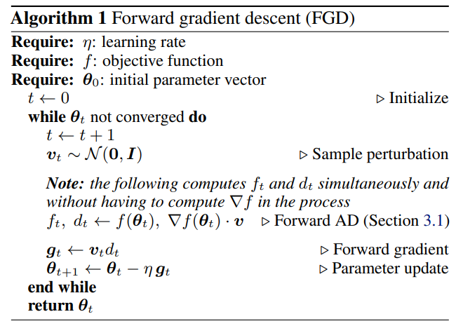

# fwdgrad

This repo contains an unofficial implementation of the paper 
[Gradients without backpropagation](https://arxiv.org/abs/2202.08587). 

  

## Repository description

In this paper, a way to compute gradients by only using the forward pass is described and 2 use cases are provided:
1. The global optimization of two famous funtions: Beale and Rosenbrok functions.
2. The well known classification task on the MNIST dataset.

In our implementation, we used the brand new [functorch](https://pytorch.org/functorch/stable/functorch.html).
Thanks to this library, the model can be treated as a function of its parameters. 
With this change of perspective, the *Jvp* of the model can be computed (for a brief explanation of what the Jvp of
a function is, check below).

We tested the above implementation on the same examples provided by the paper.

### Issue with Pytorch functionals
Since the library functorch is still in its early development, the gradient computation with respect of some of 
Pytorch's operations is not supported yet. For this reason, some of these (like the *softmax* activation and 
the *crossentropy* loss function) were redefined using standard tensor operations.  

### Jvp
The Jvp is the product of the Jacobian *J* of the model, derived with respect of the parameters,
and a vector *v* called *perturbation vector* with the same size of the parameters vector. Entries of *v* are
independent from each other and sampled from a Normal distribution with mean 0 and variance 1.

## Running the optimization
For running the optimization, simply clone the repository and, after moving to the repo root, 
use the command `python <name_of_the_example.py>`

All the examples are implemented both with the new *forward gradient* method and with backpropagation.
To let the two implementations be as similar as possible, we used the rewritten Pytorch operations also 
for the backpropagation examples (even if, in this case, Pytorch would support those operators).

### Running more examples
All the configurations are managed using [Hydra](https://hydra.cc). Configuration files are stored in the `/configs` folder.

For changing the global optimization example, modify the `global_optim_config.yaml` file.

Changing something in the MNIST example can be easily achieved by adding configuration files in the respective subfolder and changing the `config.yaml` file. These configurations can be used to change:
1. The dataset's specific, like batch size or the shuffling parameter (`/dataset` subfolder).
2. The neural network architecture (`/model` subfolder). Here two models are provided:
   1. A Multilayer Perceptron inside the default configuration
   2. A Convolutional NN inside `conv.yaml`
3. The optimization process parameters (`/optimization` subfolder).

Follow Hydra's documentation to know more about how to manage configurations.

#### Perfomance comparison
Even if in the paper the forward implementation proved to be faster, in our case we did not notice a speed-up. 
Convergence is still achieved in all the examples with roughly the same amount of steps,
but backpropagation's steps are faster than the *fwdgrad* ones. 

## License
This project is licensed under the MIT License

Copyright (c) 2022 Federico Belotti, Davide Angioni, Orobix Srl (www.orobix.com).
